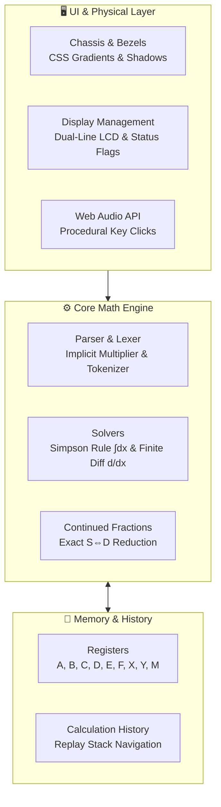

<div align="center">

# 🧮 CASIO fx-991ES PLUS
### High-Precision Web Emulator & Natural-V.P.A.M. Engine

An authentic, zero-dependency, pixel-accurate web recreation of the world's most iconic scientific calculator. Built entirely in a single standalone file using pure Web APIs.

[](https://developer.mozilla.org/en-US/docs/Web/HTML)
[](https://developer.mozilla.org/en-US/docs/Web/CSS)
[](https://developer.mozilla.org/en-US/docs/Web/JavaScript)
[](LICENSE)
[](#)

<br/>
<pre align="center">
 _________________________________________
(  CASIO                    fx-991ES PLUS )
|  [ S ][ A ][ M ][ D ][ Math ▲▼ ]        |
| ======================================= |
|   ∫(X², 0, 1)                           |
|                                     1⌟3 |
| ======================================= |
|                 [ REPLAY ]              |
|   [SHIFT] [ALPHA]   ▲   [MODE] [ ON ]   |
|                   ◀ ■ ▶                 |
|   [CALC]  [∫dx]     ▼   [x⁻¹]  [log■■]  |
|   [■/□]   [√■]    [x²]  [x■]   [log]    |
 \_______________________________________/
</pre>

</div>

---

## 🌟 Highlights

- **Pure Single-File Architecture**: Contains all HTML structure, styles, and calculation engine logic within a single file. No build steps, bundlers, npm packages, or runtime dependencies required.
- **Natural-V.P.A.M. Dual-Line LCD**: Simulates the genuine dot-matrix screen with an upper interactive input line with a blinking cursor and a bottom right-aligned result output.
- **Dynamic LCD Flags**: Reactive status annunciators for `S` (Shift), `A` (Alpha), `M` (Memory), `STO` (Store), `RCL` (Recall), `HYP` (Hyperbolic), and angle indicators `D` (Degrees), `R` (Radians), `G` (Gradians).
- **Physical REPLAY Joypad**: 4-way interactive navigation pad supporting horizontal expression cursor movement (`◀`, `▶`) and vertical calculation history recall (`▲`, `▼`).
- **Tactile Audio Synthesis**: Uses the Web Audio API to procedurally synthesize authentic micro-frequency relay clicks for every keypress—no external audio files required.

---

## ⚡ Feature Breakdown

### 1. Advanced Math & Calculus Engine
- **Numerical Integration ($\int dx$)**: Adaptive composite Simpson’s 1/3 rule evaluates definite integrals like `∫(X^2, 0, 1)`.
- **Numerical Differentiation ($d/dx$)**: Symmetric finite central difference method computes exact derivatives at a point, e.g. `d/dx(X^3, 2)`.
- **Numerical Equation Root Solving (`SOLVE`)**: Secant-based iterative solver finds solutions to non-linear equations for variable `X`.
- **Custom-Base Logarithms ($\log_a b$)**: Evaluates logarithms with arbitrary bases alongside standard $\log_{10}$ and natural $\ln$.

### 2. Exact Arithmetic & $S \Leftrightarrow D$ Toggle
- Automatic continued-fraction expansion converts floating-point solutions into exact reduced fractions (e.g. `7 ⌟ 8`).
- Cycles through **Fraction $\rightarrow$ Sexagesimal Degree-Minute-Second ($^\circ\ '\ ''$) $\rightarrow$ Floating-Point Decimal** upon pressing `S⇔D`.

### 3. Comprehensive Trigonometry & Hyperbolics
- Dedicated `hyp` key activates hyperbolic functions: $\sinh$, $\cosh$, $\tanh$, $\sinh^{-1}$, $\cosh^{-1}$, $\tanh^{-1}$.
- Full angle unit conversion across **Degrees (DEG)**, **Radians (RAD)**, and **Gradians (GRA)**.
- Implicit operator parsing handles nested functions and coefficients (e.g. `4sin(30)`, `2π`, `(3+2)(5)`).

### 4. Memory Registers & Variables
- Full variable workspace: **$A, B, C, D, E, F, X, Y, M$**.
- `SHIFT + RCL` activates `STO` mode to assign live results to any register.
- `RCL` injects stored memory values directly into active formulas.
- Dedicated `M+` and `M-` independent accumulation keys.

---

## 🚀 Quick Start

No installation, web servers, or package managers required.

1. Clone or download this repository:
   ```bash
   git clone https://github.com/altkriz/casio-fx-991es-plus.git
   ```

2.  Open the file in any modern web browser:
    # Linux / macOS
    open index.html

    # Windows
    start index.html
    Or simply double-click the .html file from your desktop or file manager.

📖 Operation Examples

| Function                 | Button Sequence                                                                                     | Screen Input Example | Result         |
| :----------------------- | :-------------------------------------------------------------------------------------------------- | :------------------- | :------------- |
| **Definite Integral**    | `∫dx`                                                                                               | `∫(X^2, 0, 1)`       | `0.3333333333` |
| **Derivative**           | `SHIFT` + `∫dx`                                                                                     | `d/dx(X^3, 2)`       | `12`           |
| **Combinations ($nCr$)** | `5` $\rightarrow$ `SHIFT` + `÷` $\rightarrow$ `2`                                                   | `5 C 2`              | `10`           |
| **Permutations ($nPr$)** | `6` $\rightarrow$ `SHIFT` + `×` $\rightarrow$ `3`                                                   | `6 P 3`              | `120`          |
| **Fraction Conversion**  | Input `0.875` $\rightarrow$ `=` $\rightarrow$ `S⇔D`                                                 | `0.875`              | `7 ⌟ 8`        |
| **Degree-Minute-Second** | Input `12.5` $\rightarrow$ `=` $\rightarrow$ `° ' "`                                                | `12.5`               | `12°30’0.0”`   |
| **Memory Storage**       | `125` $\rightarrow$ `=` $\rightarrow$ `SHIFT` + `RCL` $\rightarrow$ `A`                             | `A = 125`            | Stored in `A`  |
| **Root Solver**          | `ALPHA` + `X` $\rightarrow$ `x²` $\rightarrow$ `−` $\rightarrow$ `9` $\rightarrow$ `SHIFT` + `CALC` | `X² − 9`             | `X = 3`        |

⌨️ Desktop Keyboard Mappings

The emulator features native physical keyboard bindings for rapid data entry:

| Key on Keyboard        | Calculator Action                       |
| :--------------------: | :-------------------------------------: |
| `0` - `9`              | Digit Input                             |
| `.`                    | Decimal Point (`•`)                     |
| `+`, `-`, `*`, `/`     | Standard Operators (`+`, `−`, `×`, `÷`) |
| `(`, `)`               | Grouping Parentheses                    |
| `^`                    | Power (`x■`)                            |
| `Enter` or `=`         | Execute (`=`)                           |
| `Backspace`            | Delete Single Character (`DEL`)         |
| `Escape`               | All Clear (`AC`)                        |
| `Arrow Left` / `Right` | Move Cursor Left / Right on LCD         |
| `Arrow Up` / `Down`    | Browse Previous Expression History      |

## 🛠️ Architecture & Tech Stack



- **Markup & Styling**: Pure HTML5 with responsive CSS Grid and Flexbox layouts.
- **Audio Engine**: Synthesizes authentic tactile clicks using Web Audio oscillator nodes—no external audio files required.
- **Math Precision**: Native high-precision floating point calculation pipeline with tolerance guards to prevent rounding drift.
📄 License

This project is open-source and available under the terms of the MIT License.

